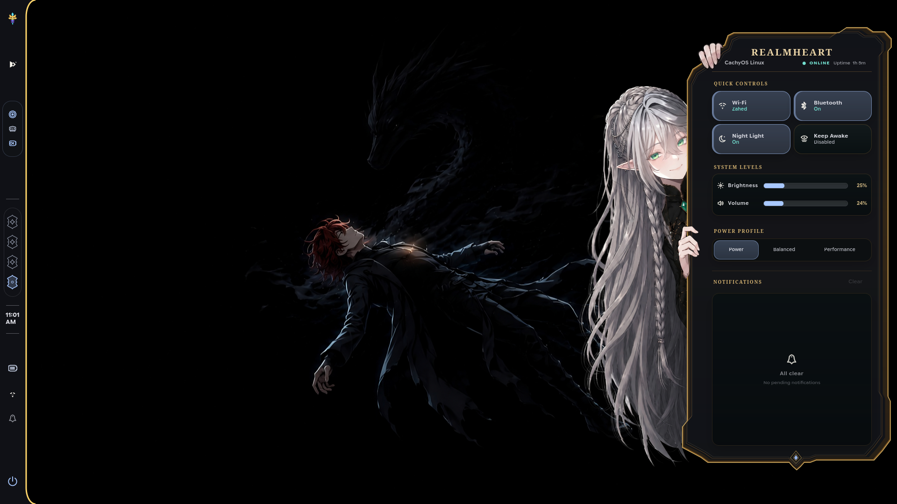
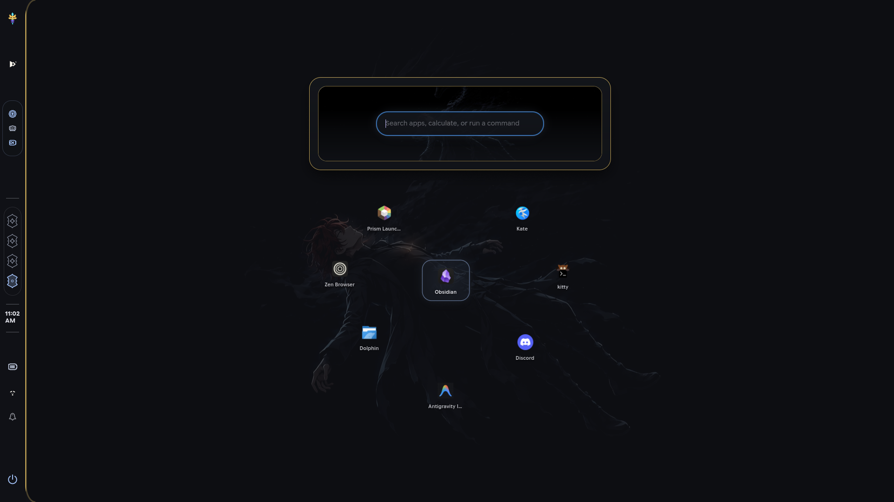
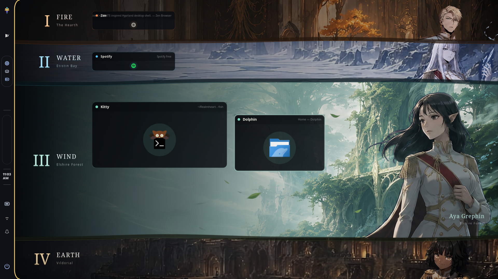
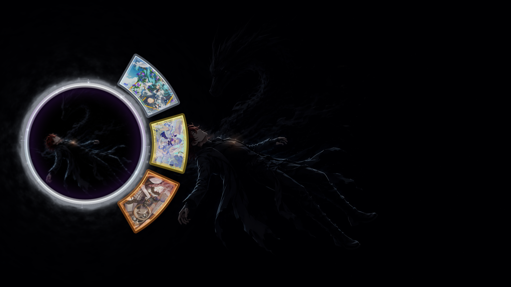
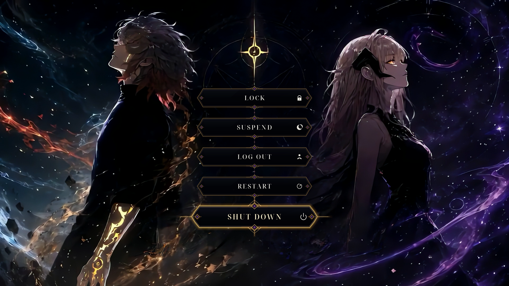
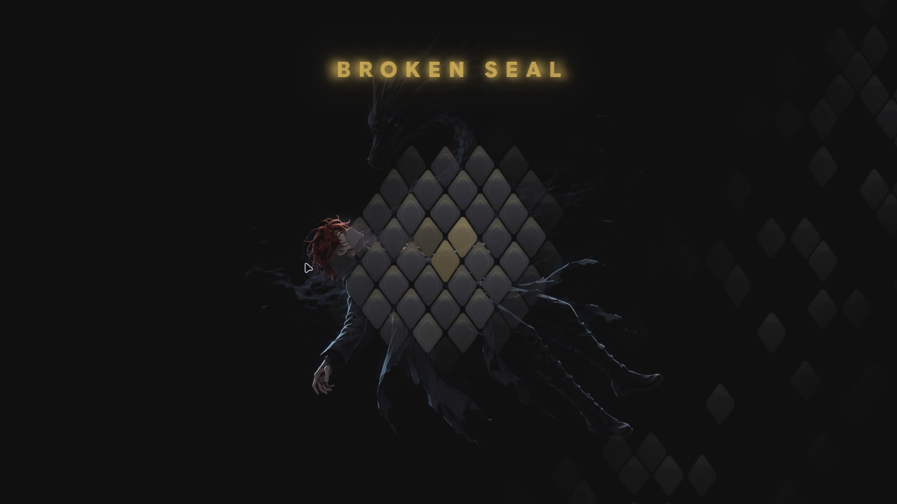

<p align="center">
  
</p>

<h1 align="center">Realmheart</h1>

<p align="center">
  <strong>A native, TBATE-inspired desktop shell for Hyprland.</strong>
  <br />
  Built in C++ and GTK 4 for a desktop that refuses to choose between
  <em>performance</em> and <em>presence</em>.
</p>

<p align="center">
  
  
  
  
  
</p>

---

## What is Realmheart?

Realmheart is a desktop shell for Hyprland that replaces your separate bar,
launcher, sidebar, notification daemon, wallpaper tools and session menus with
one program. It's written in C++ and GTK 4, everything runs natively on
Wayland, and the whole look comes from The Beginning After the End.

I build it for my own machine first. Everything else is secondary.

## Screenshots

### Status bar and control panel



### Launcher



### Workspace overview



### Wallpaper switcher



### Power menu



### Lock screen



---

## Showcase Video

https://github.com/user-attachments/assets/0efbbdd1-fc3a-41f3-87fb-a696f99375a5

---

## Features

| | |
| --- | --- |
| **Status bar** | Clock, workspace runes with previews, system monitor, media controls, battery, network, notifications, quick notes. |
| **Launcher** | App search with usage-aware ranking, window focusing, calculator, fish command execution, clipboard history, emoji search. |
| **Control panel** | Wi-Fi, Bluetooth, volume, brightness, Night Light, power profiles, GameMode, notification history. |
| **Lock screen** | Custom shader-rendered lock surface with real PAM authentication. |
| **Power menu** | Fullscreen animated scene with lock, suspend, logout, reboot, and power-off. |
| **Wallpaper engine** | Native Wayland/EGL renderer with output-aware cropping and smooth transitions. Every wallpaper change also regenerates the theme colors. |
| **Wallpaper switcher** | Carousel overlay to cycle through, preview, and apply wallpapers from your library. |
| **Notifications** | D-Bus server, transient toasts, unread state, persistent history. |
| **Utilities** | Screenshots, region capture, screen recording, brightness/volume OSDs. |
| **Hyprland plugin** *(optional)* | Compositor-level window open/close effects. |


---

## Dependencies

### Build

```bash
sudo pacman -S --needed \
  base-devel cmake ninja pkgconf gtest \
  gtk4 gtk4-layer-shell glib2 gdk-pixbuf2 \
  libjpeg-turbo libepoxy
```

The native wallpaper renderer is built automatically when these are present:

```bash
sudo pacman -S --needed wayland wayland-protocols wlr-protocols mesa
```

### Runtime

Core: `hyprctl`, `brightnessctl`, `wpctl`, `nmcli`, `bluetoothctl`,
`powerprofilesctl`, `matugen`.

Optional extras:

| Command | Enables |
| --- | --- |
| `grim` + `slurp` | Screenshots and region capture |
| `wl-clipboard` + `cliphist` | Clipboard integration and history |
| `wf-recorder` | Screen recording |
| `hyprlock` / `hypridle` | Lock action and idle handling |
| `hyprsunset` | Night Light |

---

## Install and run

> [!WARNING]
> This shell is in heavy development. Don't put it on a machine you care about.

> [!NOTE]
> A proper setup script is coming. Until then, expect to assemble things by
> hand.

```bash
git clone https://github.com/kzahed610/Realmheart.git
cd Realmheart

# ⚠️  FRESH ACCOUNT / COPIED FROM ANOTHER MACHINE?
# The build tree (build-hybrid/) does NOT transfer between accounts or machines.
# It bakes your home path into CMAKE_SOURCE_DIR; a stale build-hybrid/ copied in
# from another checkout produces the cryptic
#   "CMakeCache.txt directory ... is different" / "Permission denied" errors.
# Always nuke any pre-existing build dir first (no-op if it isn't there):
rm -rf build-hybrid

# IMPORTANT: never run cmake/build with sudo. Running as root changes the
# effective user and trips CMake's source-cache mismatch check. sudo is only
# needed for the system PAM service (see install-hypr-configs.sh).
cmake -S . -B build-hybrid -G Ninja \
  -DCMAKE_BUILD_TYPE=RelWithDebInfo \
  -DREALMHEART_ENABLE_NATIVE_WALLPAPER=ON \
  -DBUILD_TESTING=ON

cmake --build build-hybrid -j"$(nproc)"
```

Check your environment first, then start the shell:

```bash
./build-hybrid/realmheart --doctor
./build-hybrid/realmheart --shell --wallpaper-backend native
```

Autostart with Hyprland:

```ini
exec-once = /absolute/path/to/Realmheart/build-hybrid/realmheart --shell --wallpaper-backend native
```

### Hyprland config setup

Realmheart ships portable Hyprland configs under `config/`. To install them
into your `~/.config/hypr/` and `~/.config/realmheart/` directories, plus a
helper into `~/.local/bin/realmheart-fx-load`, use the installer:

```bash
./install-hypr-configs.sh
```

The installer walks `config/hypr/`, `config/realmheart/`, `config/bin/` and
`config/pam/`, copying each file to the matching destination under `$HOME`
and saving any existing file as `<file>.bak.<timestamp>`. It auto-detects
root-owned files and prompts for sudo. After copying, reload Hyprland:

```bash
hyprctl reload
```

If you ever see absolute paths from a previous checkout baked into the
binary (the classic "/home/you path error"), delete the build tree and
reconfigure from scratch:

```bash
rm -rf build-hybrid
cmake -S . -B build-hybrid -G Ninja \
  -DCMAKE_BUILD_TYPE=RelWithDebInfo \
  -DREALMHEART_ENABLE_NATIVE_WALLPAPER=ON
```

### Optional: FX plugin

The window open/close effects plugin is optional. After building, load it:

```bash
hyprctl plugin load ~/Realmheart/build-hybrid/realmheart-fx.so
```

Once `install-hypr-configs.sh` has copied `realmheart-fx-load` into
`~/.local/bin/`, it will auto-load at Hyprland startup via
`realmheart_fx.lua`. The loader searches the build tree first, then common
install locations.

A running shell is controlled without restarting the session:

```bash
realmheart --command <name>
```

Run the test suite with `ctest --test-dir build-hybrid --output-on-failure`.

---

## Versions and compatibility

Realmheart moves with Hyprland. The shell needs the Lua config era, meaning
Hyprland **0.55 or newer**. Development happens against **0.56.x**, which is
where it gets battle-tested daily. If you pin an older Realmheart tag, match
it roughly to a Hyprland release from the same period.

Currently used elsewhere: GTK 4.12 or newer (development on 4.22),
gtk4-layer-shell 1.3, matugen 4.x.

The optional FX plugin compiles against Hyprland's internal plugin ABI and
must be rebuilt after every Hyprland update. The current build targets the
0.56 ABI.

Tested setup: CachyOS, Hyprland 0.56.2, GTK 4.22, 1080p, 8 GB RAM laptop.

If your combination looks different (other distro, odd resolution, older
Hyprland) it may still work. Try it in a throwaway user account first, not
your main one.

---

## Roadmap

Rough order, no dates:

- More display support: ultrawide, 4K, mixed multi-monitor setups.
- A few selected distributions beyond Arch/CachyOS.
- More widgets.
- A settings overlay for customizing Realmheart itself plus some general
  system behaviour, partly aimed at people switching from Windows. Least
  certain item on the list.

None of this is scheduled. It's a hobby project and the roadmap bends toward
whatever turns out to be fun to build.

---

## Notes

- Realmheart is licensed under the GPL-3.0. See [LICENSE](LICENSE).
- The optional plugin under `plugins/realmheart-fx/` is ABI-coupled to Hyprland
  and must be rebuilt after Hyprland updates. Extra attribution lives in
  `plugins/realmheart-fx/`.
- Unofficial fan project inspired by The Beginning After the End, not
  affiliated with the creators or rights holders.

---

<p align="center">
  <strong>Realmheart</strong><br />
  Native where it matters. Excessive where it counts.
</p>
